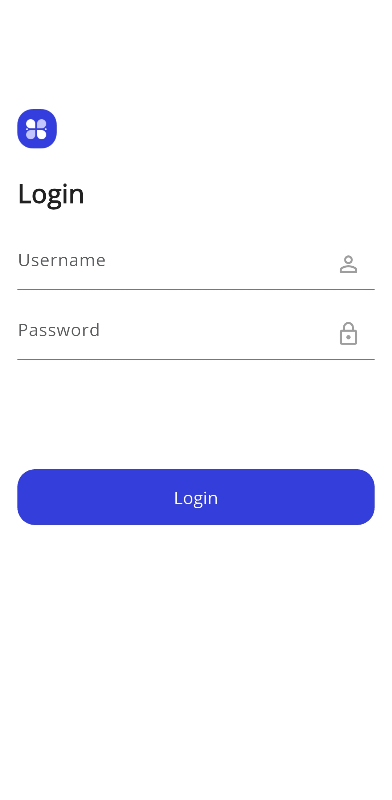
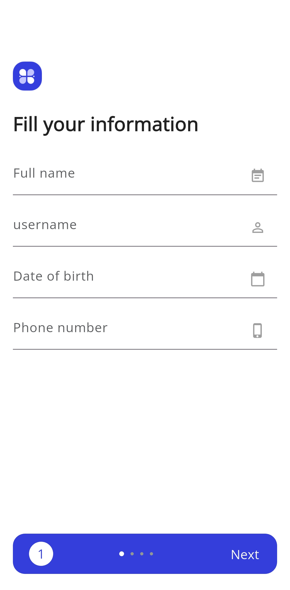
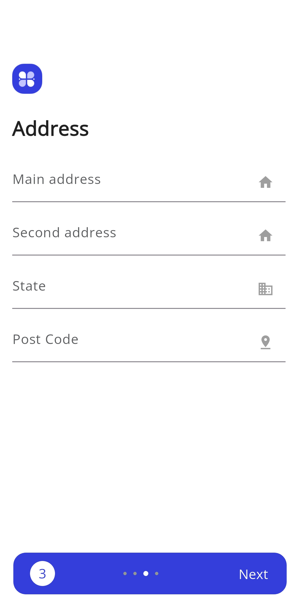
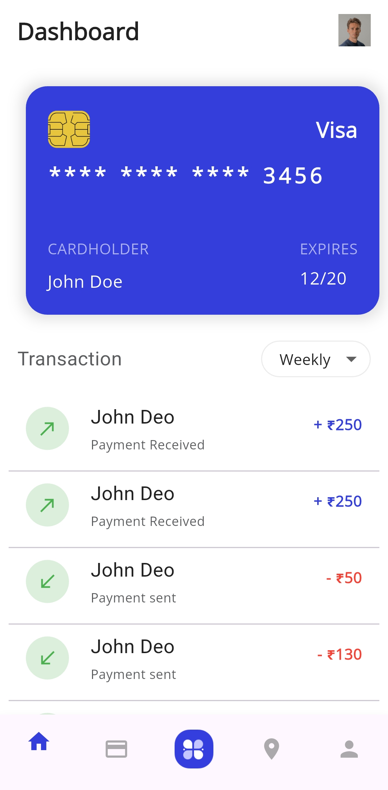
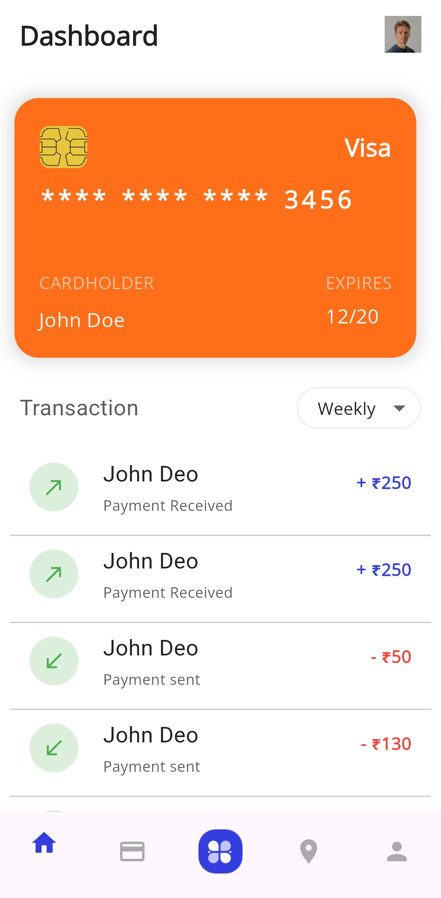
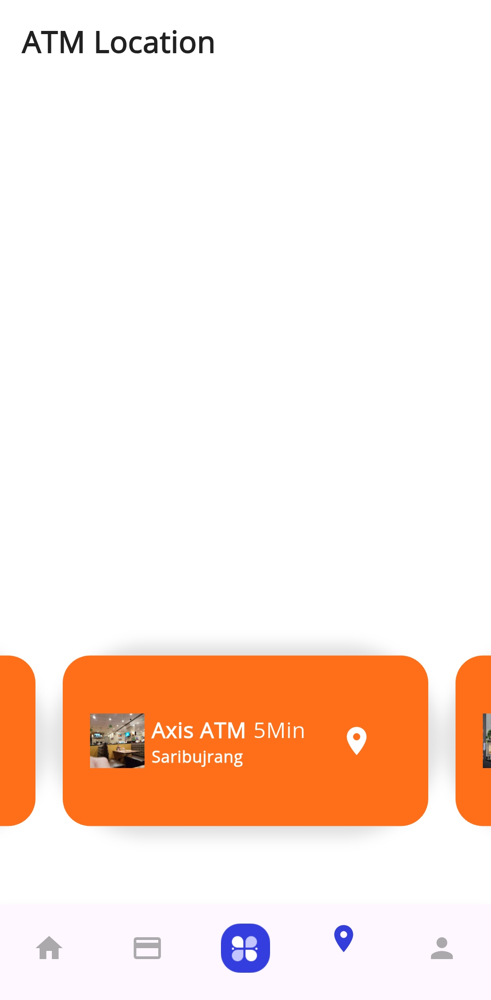
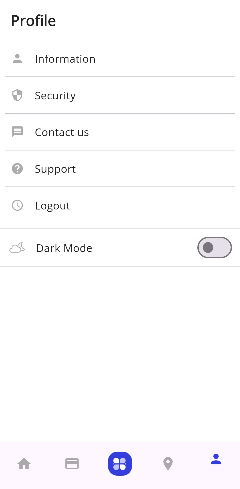
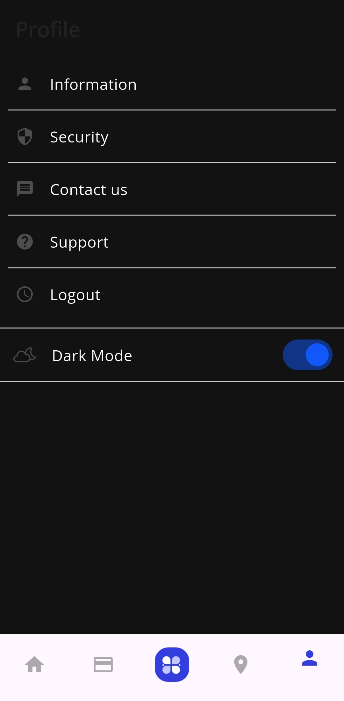

# OraPay ProKit – UI Demo

A Flutter UI demo app for a modern payment or finance solution interface.  
This is a **UI-only** project – no backend or actual payment integration.

---

## 📱 Overview

The app includes design elements suited for:

- Wallets and transactions
- Payment history
- Transfer screens
- Financial dashboards

---

## 🔍 Status

**Demo only** – UI focus without functional implementation.

---

## 📸 Screenshots

<table>
  <tr>
    <td></td>
    <td></td>
    <td></td>
    <td></td>
  </tr>
  <tr>
    <td></td>
    <td></td>
    <td></td>
    <td></td>
  </tr>
  <tr>
    <td></td>
    <td></td>
    <td></td>
    <td></td>
  </tr>
</table>

---

## 📝 Notes

- Built using Flutter
- Fully responsive layouts
- Ideal base for payment, finance, or banking apps

---

## ✍️ Created by

**Mohamed Ebrahim**
